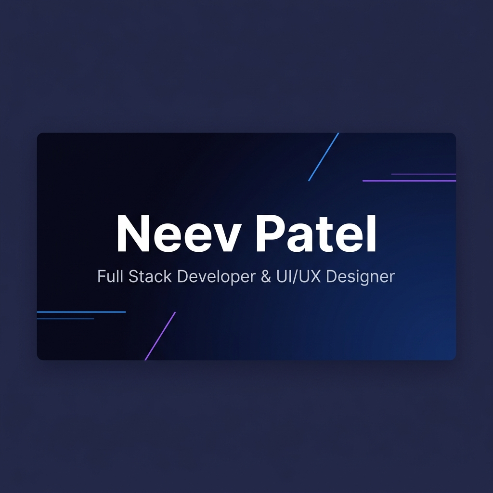

<div align="center">

# ✦ Neev Patel — Portfolio

### A cinematic, production-grade developer portfolio built with React, GSAP, Three.js, and Tailwind CSS.

[](https://neev-patel-portfolio.vercel.app/)
[](https://react.dev/)
[](https://gsap.com/)
[](https://threejs.org/)
[](https://tailwindcss.com/)
[](https://vercel.com/)

<br/>



</div>

---

## 📖 Overview

A **cinematic personal portfolio** designed to feel like a premium product launch page — featuring scroll-driven animations, 3D WebGL scenes, horizontal project galleries, and buttery-smooth 60 FPS transitions. Every detail — from the text reveal masks to the parallax depth layers — is hand-tuned to deliver a jaw-dropping first impression.

**🔗 Live:** [neev-patel-portfolio.vercel.app](https://neev-patel-portfolio.vercel.app/)

---

## ✨ Key Features

| Feature | Description |
|---------|-------------|
| 🎬 **Cinematic Hero** | Full-screen landing with staggered text reveals, scroll-pinned zoom-out exit, and floating 3D torus geometries rendered via React Three Fiber |
| 🎭 **Masked Text Reveals** | SplitType-powered line/word splitting with GSAP scroll-scrubbed entrance animations and overflow-hidden masking |
| 📜 **Scroll-Driven Transitions** | Every section uses GSAP ScrollTrigger for parallax depth, scale entrances, blur-to-sharp reveals, and wipe overlays |
| 🖼️ **Horizontal Project Gallery** | Pinned horizontal-scroll showcase with per-card 3D entrances, image parallax, and a live project counter |
| 🎨 **Figma Designs Section** | UI/UX design showcase with hover overlays, Figma deep-links, and a full-screen image lightbox |
| 🏆 **Hackathons Timeline** | Vertical timeline layout with animated progress line, staggered card reveals, and badge-based result indicators |
| 📜 **Certificates Grid** | Card grid with org logos, credential IDs, and proof lightbox/verification links |
| 📧 **Contact Form** | EmailJS-integrated form with validation, toast notifications, and animated social media links |
| 🧭 **Multi-Route Architecture** | React Router with isolated section routes (`/about`, `/skills`, `/certificates`, etc.) and a full single-page home |
| 🧈 **Smooth Scroll** | Lenis smooth-scroll engine with custom React context integration |
| 📊 **Scroll Progress Bar** | Top-of-page progress indicator tracking scroll position in real-time |
| 🔍 **Full SEO** | Open Graph, Twitter Cards, sitemap.xml, robots.txt, canonical URLs, and structured meta tags |

---

## 🏗️ Architecture

```
src/
├── App.jsx                    # Router + layout + ScrollToTop
├── main.jsx                   # React 19 entry + BrowserRouter
├── index.css                  # Design tokens + global styles
│
├── components/
│   ├── Hero.jsx               # Cinematic landing (pinned scroll + zoom)
│   ├── HeroScene.jsx          # Three.js floating geometry (R3F Canvas)
│   ├── About.jsx              # Bio + signature card + parallax layers
│   ├── Skills.jsx             # 3-column skill cards + 3D entrances
│   ├── Projects.jsx           # Horizontal scroll gallery (pinned)
│   ├── FigmaDesigns.jsx       # UI/UX showcase + lightbox modal
│   ├── Certificates.jsx       # Certificate grid + lightbox proofs
│   ├── Hackathons.jsx         # Timeline layout + animated progress
│   ├── Contact.jsx            # EmailJS form + social links
│   ├── Navbar.jsx             # Fixed nav + route-aware active state
│   ├── ChapterSection.jsx     # Cinematic section wrapper (scrub/fade)
│   ├── MaskedTextReveal.jsx   # SplitType text animation engine
│   ├── ScrollProgress.jsx     # Top progress bar
│   ├── SmoothScroll.jsx       # Lenis context provider
│   └── RevealOnScroll.jsx     # Utility scroll-reveal wrapper
│
├── hooks/
│   ├── useActiveSection.js    # Navbar active-state tracking
│   ├── useStandaloneRoute.js  # Standalone route context (animation strategy)
│   ├── usePinnedContainer.js  # Pinned container context for ScrollTrigger
│   ├── useScrollProgress.js   # Scroll progress percentage
│   └── useTextReveal.js       # Text reveal animation hook
│
├── data/
│   ├── projects.js            # Project cards data
│   ├── skills.js              # Skill categories data
│   ├── certificatesData.js    # Certificates data
│   ├── hackathonData.js       # Hackathon entries data
│   └── figmaData.js           # Figma designs data
│
public/
├── favicon.svg                # Site icon
├── og-image.png               # Open Graph social preview
├── robots.txt                 # Search engine crawler rules
└── sitemap.xml                # Sitemap for Google indexing
```

---

## 🛠️ Tech Stack

| Layer | Technology |
|-------|-----------|
| **Framework** | React 19 + Vite 8 |
| **Routing** | React Router v7 |
| **Animation** | GSAP 3 + ScrollTrigger + SplitType |
| **3D** | Three.js + React Three Fiber + Drei |
| **Smooth Scroll** | Lenis |
| **Motion** | Framer Motion (lightbox transitions) |
| **Styling** | Tailwind CSS 3 + custom design tokens |
| **Icons** | React Icons (Feather + Font Awesome + Simple Icons) |
| **Email** | EmailJS |
| **Deployment** | Vercel (auto-deploy from GitHub) |
| **SEO** | Open Graph, Twitter Cards, Sitemap, robots.txt |

---

## 🚀 Getting Started

### Prerequisites

- **Node.js** ≥ 18.x
- **npm** ≥ 9.x

### Installation

```bash
# Clone the repository
git clone https://github.com/neev3654/Portfolio.git
cd Portfolio

# Install dependencies
npm install

# Start development server
npm run dev
```

The app will be running at **http://localhost:5173**

### Build for Production

```bash
npm run build
npm run preview    # Preview the production build locally
```

---

## 📁 Data Configuration

All content is data-driven. To customize, edit these files:

| File | What to Edit |
|------|-------------|
| `src/data/projects.js` | Your project titles, descriptions, tech stacks, images, and links |
| `src/data/skills.js` | Skill categories, titles, and individual skills |
| `src/data/certificatesData.js` | Certificate titles, orgs, dates, proof images/links |
| `src/data/hackathonData.js` | Hackathon events, problems, solutions, outcomes, badges |
| `src/data/figmaData.js` | UI/UX design projects with Figma links and preview images |

---

## 🎨 Design System

The portfolio uses a custom light-theme design system with CSS custom properties:

| Token | Value | Usage |
|-------|-------|-------|
| `--color-bg` | `#f5f5f7` | Page background |
| `--color-card` | `#ffffff` | Card surfaces |
| `--color-text` | `#1d1d1f` | Primary text |
| `--color-muted` | `#86868b` | Secondary text |
| `--color-accent-blue` | `#2997ff` | Primary accent |
| `--color-accent-purple` | `#a259ff` | Secondary accent |

---

## 🧠 Animation Architecture

The animation system uses a **dual-mode strategy**:

- **Home Page (`/`)** — Full cinematic scroll-scrub animations via GSAP ScrollTrigger. Sections fade in from `opacity: 0` with scale, blur, and parallax effects tied to scroll position.
- **Standalone Routes** (`/certificates`, `/hackathons`, etc.) — Immediate fade-in tweens that play on mount without ScrollTrigger, since the section is already at the top of the viewport.

This is powered by the `useStandaloneRoute` context hook that propagates through `ChapterSection`, `MaskedTextReveal`, and all section components.

---

## 📄 License

This project is open source and available under the [MIT License](LICENSE).

---

<div align="center">

**Built with ❤️ by [Neev Patel](https://neev-patel-portfolio.vercel.app/)**

</div>
